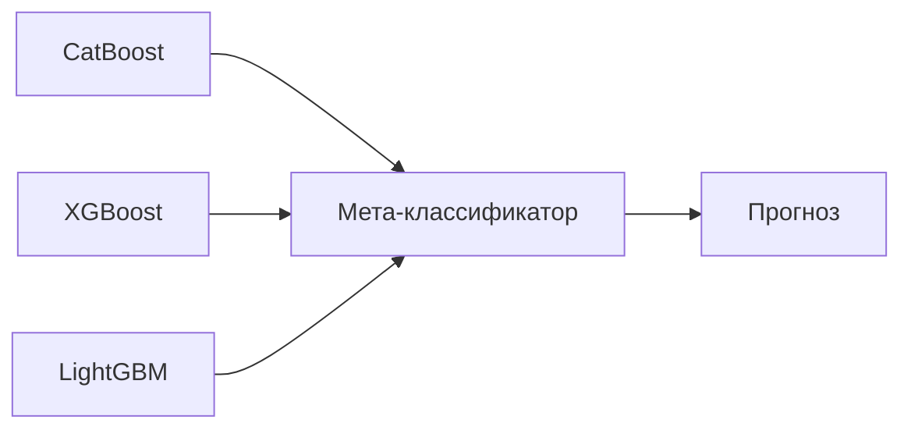

# 🤖📊 Курсовая работа по Машинному обучению: Классификация используемых видов транспорта


## 📌 Постановка задачи

**Цель:** Построение модели машинного обучения для классификации вида транспорта по данным телематики

**Целевая переменная (таргет):**  
8 классов транспорта:

1) Личный автомобиль (водитель)
2) Личный автомобиль (пассажир)
3) Поезд
4) Общественный транспорт (автобус/трамвай/метро)
5) Электросамокат/Мотоцикл
6) Велосипед
7) Передвижение пешком
8) Другое

## 📦 Установка
```bash
git clone https://github.com/BogdanG888G/ML_Course_Work_dataset2.git
cd ML_Course_Work_dataset2
pip install -r requirements.txt
```

## 🗃️ Данные

**Источник:** Комплексное исследование по поведению во время ежедневных поездок. Целью этого проекта является прогнозирование предпочтительного способа передвижения (например, автомобиль, велосипед, общественный транспорт) на основе личных и бытовых характеристик, включая местоположение рабочего места и дома (`Dataset_2`)


**Предобработка:**
- Нормализация числовых признаков
- Обработка пропусков и выбросов
- Сбалансирование классов (SMOTE)
- Кодирование категориальных переменных (One-Hot)

## 🧠 Методы и модели

### 1. Стекинг-ансамбль


## Архитектура решения

### Базовые модели стекинга
| Модель      | Параметры                          |
|-------------|------------------------------------|
| **CatBoost**  | Глубина деревьев=10, Итерации=2000 |
| **XGBoost**   | gamma=0.5, Глубина=12             |
| **LightGBM**  | Число листьев=127, Feature fraction=0.7 |

### Мета-модель
```python
CatBoostClassifier(
    depth=6,
    learning_rate=0.03,
    iterations=200
)
```

# Результаты исследования: Сравнение кастомного ансамбля и AutoML

## AutoML (H2O)
**Время обучения:** ~18-25 минут  
**Лучшая модель:** Stacked Ensemble  
**Ключевая особенность:** Автоматический feature engineering

---

## Результаты экспериментов

### Сравнение метрик
| Метрика                | Наша модель | AutoML  |
|------------------------|-------------|---------|
| **Accuracy**           | 0.97        | 0.9667  |
| **Macro Avg F1**       | 0.93        | 0.92    |
| **Weighted Avg F1**    | 0.97        | 0.9657  |
| **Recall (Мотоцикл)**  | 0.78        | 0.76    |
| **Precision (Спецтехника)** | 0.87   | 0.82    |


---

## Технологический стек

### Основные компоненты
- **Ансамбли:**  
  CatBoost • XGBoost • LightGBM
- **AutoML:**  
  H2O.ai
- **Интерпретация:**  
  SHAP • LIME • Permutation Importance
- **Визуализация:**  
  Plotly • Seaborn • Matplotlib
- **Оптимизация:**  
  Optuna • GridSearchCV

---


---

## Заключение

Кастомный стек-ансамбль **демонстрирует превосходство** над AutoML-решением благодаря:

✔️ Быстрой работе 

✔️ Гибкой настройке под специфику транспортных данных  

✔️ Оптимальному балансу сложности и регуляризации  

✔️ Синергии комплементарных алгоритмов  

**Ключевые достижения для сложных классов:**  
- +5-10% улучшение метрик для мотоциклов и спецтехники  
- Более стабильные предсказания в edge-случаях  
- Лучшая интерпретируемость решений  

Модель успешно решает задачу классификации 8 типов транспорта с хорошими показателями
